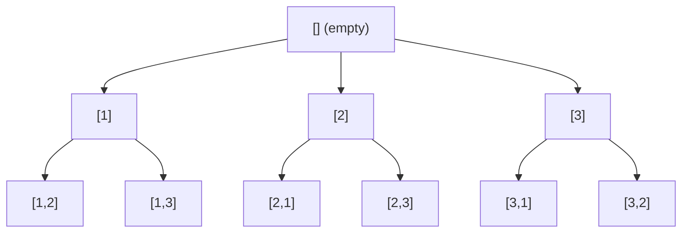

# Backtracking - From Scratch (with N-Queens) - Java Edition

<a id="top"></a›
> A practical, intuition-first guide to backtracking in **Java**: what it is, when
> to use it, the universal template, complexity analysis, and a fully worked
> N-Queens solution.

---

## Table of Contents

1. [What- Is Backtracking?](#1-what-is-backtracking)
2. [The Core Idea (Intuition)](#2-the-core-idea-intuition)
3. [Backtracking vs. Brute Force vs. DP](#3-backtracking-vs-brute-force-vs-dp)
4. [The State-Space Tree](#4-the-state-space-tree)
5. [The Universal Backtracking Template (Java)](#5-the-universal-backtracking-template-java)
6. [Warm-Up Example: Subsets](#6-warm-up-example-subsets)
7. [Warm-Up Example: Permutations](#7-warm-up-example-permutations)
8. [NeetCode 150 Spotlight: Combination Sum](#8-neetcode-156-spotlight-combination-sum)
9. [N-Queens: The Classic Problem](#9-n-queens-the-classic-problem)
10. [N-Queens: Step-by-Step Walkthrough (4x4)](#10-n-queens-step-by-step-walkthrough-44)
11. [N-Queens: Optimized Java Implementation](#11-n-queens-optimized-java-implementation)
12- [Complexity Analysis](#12-complexity-analysis)
13. [Pruning: The Heart of Efficiency](#13-pruning-the-heart-of-efficiency)
14. [Common Pitfalls & Tips (Java-specific)](#14-common-pitfalls--tips-java-specific)
15. [Practice Problems](#15-practice-problems)
16. [Cheat Sheet](#16-cheat-sheet)

---

## 1. What Is Backtracking?
**Backtracking** is a general algorithmic technique for solving problems
*incrementally*, building candidates to the solution one piece at a time, and
**abandoning** a candidate ("backtracking") as soon as it determines the candidate cannot possibly lead to a valid solution.
Think of it as a smart, systematic **trial and error**:
> "Try a choice → explore deeper + if it fails, undo the choice and try the next one."
It is essentially a **depth-first search (DFS)** over the space of all possible partial solutions, with ""pruning** to skip branches that can't work.
### When should you reach for backtracking?
Use backtracking when a problem asks you to:
- Find **all** solutions (e.g, all permutations, all subsets) .
- Find **any one**valid solution (e.g., solve a Sudoku).
- Find the **best** solution among many (sometimes - though DP/greedy may be better).
- Satisfy a set of **constraints** (Constraint Satisfaction Problems).
Typical keywords in problem statements: *"all combinations"*, *"all paths"*,*"generate every"*, *"place items so that..."*, *"is there an arrangement..."*.

<div align="left"><a href="#top">Back to top</a></div›

---

## 2. The Core Idea (Intuition)
Imagine you're navigating a maze. At each junction you:
1. **Pick** a direction (make a choice).
2. **Walk** forward (recurse / go deeper).
3. If you hit a dead end, **walk back** to the last junction (undo the choice).
4. Try the **next** unexplored direction.
5. Repeat until you escape (solution found) or exhaust all paths (no solution).
The "walk back and undo" step is the **backtrack**. The crucial optimization is: if you can *tell early* that a path leads nowhere, you don't waste time walking all the way down it. That early detection is called **pruning**.
``` 
     start
    /  |  \
   A   B   C  <-- choices at level 1
  /|   |   |
  ... (dead...
       end --> backtrack)
```

<div align="left"><a href="#top">Back to top</a></div›

---

## 3. Backtracking vs. Brute Force vs. DP
| Aspect | Brute Force | Backtracking | Dynamic Programming |
|---|---|---|---|
| Strategy | Generate *all* candidates, then test | Build incrementally, **prune** invalid early | Reuse overlapping subproblem results |
| Wasted work | Lots | Much less (pruning) | Minimal (memoization) |
| Best for | Tiny inputs | Constraint satisfaction, enumeration | Optimization with overlapping subproblems |
| Example | List all 20 subsets then filter | Stop building a subset once it's invalid | Longest common subsequence |

**Key insight:** Backtracking = Brute force + **early abandonment** of doomed paths.
Without pruning, backtracking degrades into plain brute force.

<div align="left"><a href="#top">Back to top</a></div›
     
---

## 4. The State-Space Tree
Every backtracking problem can be visualized as a tree:
- **Root** = empty / initial partial solution.
- **Edges** = a single choice (e.g., "place queen in column 3").
- **Nodes** = partial solutions (states) .
- **Leaves** = either complete solutions or dead ends.
  
Backtracking is a **DFS traversal** of this tree where we:

- **Descend** when a partial solution is still *promising*.
- **Prune** (cut the subtree) when a partial solution is *invalid*.
- **Record** when we reach a *complete valid* solution (leaf).

<div align="left"><a href="#top">Back to top</a></div›
  
---

## 5. The Universal Backtracking Template (Java)

Almost every backtracking solution fits this shape:
```java
void backtrack(State state) {
  if (isSolution(state)) {
    record(state);  // found a complete valid solution
    return;  // (or " return true" if you only need one)
}

for (Choice choice : getcandidates(state)) {
  if (isValid(state, choice)) { // <-- PRUNING happens here
    makeChoice(state, choice); // 1. choose
    backtrack(state); // 2. explore
    undoChoice(state, choice); // 3. un-choose (BACKTRACK)
  }
 }
}
```

The three magic steps inside the loop - **choose → explore + un-choose** - are the signature of backtracking. The `isValid` check is what keeps it efficient.
> **Mnemonic:** *Choose, Explore, Un-choose.*

<div align="left"><a href="#top">Back to top</a></div›

---

## 6. Warm-Up Example: Subsets
Generate all subsets of `[1, 2, 3]`.
```java 
import java.util.*;

public class Subsets {
  public List‹List‹Integer>> subsets(int[] nums) {
    List‹List<Integer>> result = new ArrayList<>(); 
    backtrack(nums, 0, new ArrayList<>(), result):
    return result;
  }
  private void backtrack(int[] nums, int start,List<Integer> path, List‹List<Integer>> result) {
    result.add(new ArrayList>(path));  // every node is a valid subset
    for (int i = start; 1 < nums.length; i++) {
      path.add(nums [i]);  // choose
      backtrack(nums, i + 1, path, result); // explore
      path. remove(path.size() - 1); // un-choose (backtrack)
    }
  }
}
// subsets ([1,2,3]) ->
// [[], [11, [1,21, [1,2,3], [1,3]. [2], [2,3], [3]]
```

Notice the **choose + explore + un-choose** rhythm with `add` / `remove` .
Also note `new ArrayList<>(path)` - we store a **copy**, not the live reference.

<div align="left"><a href="#top">Back to top</a></div›

---

## 7. Warm-Up Example: Permutations
Generate all orderings of '[1, 2, 31".
```java
import java.util.*;
public class Permutations {
     public List‹ List‹Integer›> permute(int[] nums) {
          List‹List<Integer>> result = new ArrayList<>();
          boolean[] used = new boolean[nums.length];
          backtrack(nums, used, new ArrayList>(), result);
          return result;
     }
     private void backtrack(int[] nums, boolean[] used,List‹Integer> path, List<List<Integer>> result) {
          if (path.size() == nums.length) { // isSolution
               result.add(new ArrayList>(path)):
               return;
          }
          for (int 1 = 0; i < nums.length; i++) {
               if (used[i]) continue;  // pruning: skip already-used
               used [1] = true; // choose
               path.add(nums [i]);
               backtrack(nums, used, path, result): // explore
               path. remove(path.size() - 1); // un-choose
               used[i] = false;
          }
     }
}
```

<div align="left"><a href="#top">Back to top</a></div›

---

## 8. NeetCode 150 Spotlight: Combination Sum
> **Problem (LeetCode 39):** Given an array of **distinct** integers `candidates`
> and a `target`, return all **unique** combinations whose numbers sum to
> `target`. The **same** number may be chosen an **unlimited** number of times.

This is the exact same backtracking machinery as Subsets/Permutations - only the constraints change. Two ideas drive it:
1. **Pruning by the running total.** Subtract each pick from "remaining". If `remaining == 6` we found a valid combination; if `remaining < o` we overshot and abandon the branch immediately.
2. **Avoiding duplicate combinations.** Pass a `start` index so each level only considers candidates from the current position onward. Crucially we recurse with `i` (not `i + 1`) so the **same** number can be reused, while still never revisiting earlier numbers (which would produce permuted duplicates like `[2,3]` and `[3,2]`).

```java
import java.util.*;
public class CombinationSum {
     public List‹List<Integer>> combinationSum(int[] candidates, int target) {
          List‹List<< Integer>> result = new ArrayList<>();
          backtrack(candidates, target, 0, new ArrayList<>(), result);
          return result;
     }
     private void backtrack(int[] candidates, int remaining, int start, List‹Integer> path, List‹List<Integer>> result) {
     if (remaining == 0) {  // isSolution: hit the target
          result.add(new ArrayList>(path));
          return;
     }
     if (remaining < 0) { // pruning: overshot the target
          return;
     }
     for (int i = start; i ‹ candidates.length; i++) {
          path.add (candidates [i]); // choose
          // pass "i" (not "i + 1º) so the same number can be reused
          backtrack(candidates, remaining - candidates[i], i, path, result);
          path.remove(path.size() - 1); // un-choose (backtrack)
          }
     }
}
// combinationSum([2,3,6,7], 7) -> [[2,2,3], [7]]
```

### How it maps to the template
| Template step | Combination Sum |
|---|---|
|`isSolution` | `remaining == 0` |
| Pruning | `remaining ‹ 0` (overshoot) + `start` index (no duplicates) |
| Choose | `path.add(candidates[i])` |
| Explore | recurse with `remaining - candidates[i]`, same `i` for reuse I |
| Un-choose | `path.remove(path.size() - 1)` |

Notice the identical **choose + explore + un-choose** rhythm, and again we store
`new ArrayList<>(path)` - a **copy**, never the live reference.
**Tiny tweak + a different problem.** Recurse with `i + 1` instead of `i` and
> you get **Combination Sum II** (each number used at most once). Add a sort plus
> a `if (i > start && candidates[i] == candidates[i-1]) continue;` skip and it
> handles duplicate inputs too. Same skeleton, new constraints.

<div align="left"><a href="#top">Back to top</a></div›

---

## 9. N-Queens: The Classic Problem
> **Problem:** Place "N° queens on an "N*N" chessboard so that **no two queens
> attack each other**. A queen attacks along its **row**, **Column**, and both
> **diagonals**. Return all distinct valid placements.

### Why it's a perfect backtracking problem
- We build the solution **one row at a time** (place exactly one queen per row).
- At each row, we **try every column**
- We **prune** any column that is attacked by a previously placed queen.
- If no column works in a row, we **backtrack** to the previous row and move its queen.
  
### Key observation that shrinks the problem
Since two queens can never share a row, we place **exactly one queen in each row**.
This reduces the search from "choose N squares out of N2" to "choose one column for each of the N rows" - a state-space tree of depth `N` with up to `N` branches per node.

### Detecting attacks in 0(1)
For a queen at `(row, col)`:
- **Same column:** another queen has the same `col`.
- **Same \ diagonal (top-left + bottom-right):** cells where `row - col` is equal.
- **Same / diagonal (top-right - bottom-left):** cells where `row + col` is equal.
